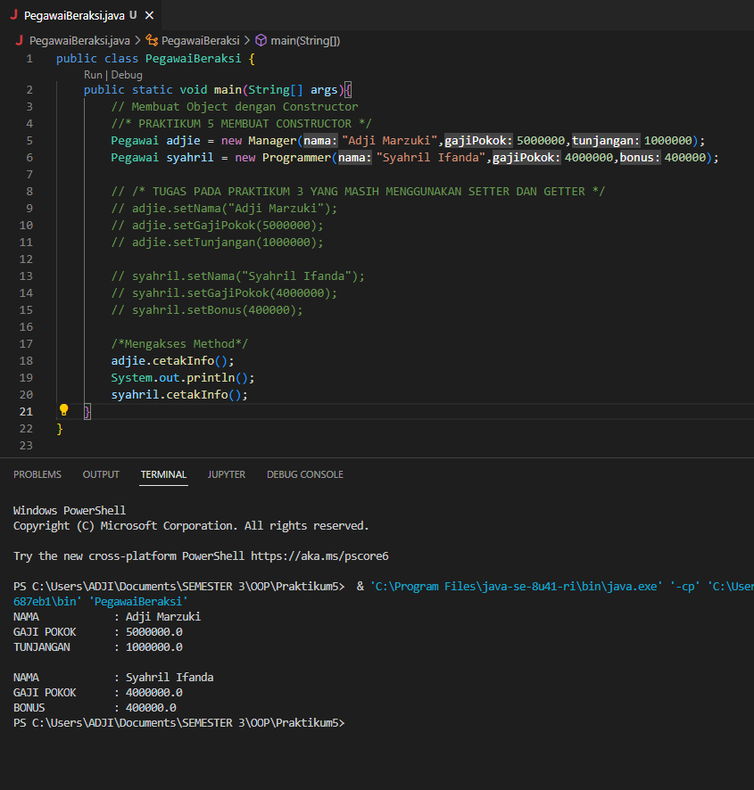

# Praktikum5  
### CONSTRUCTOR  
•Constructor merupakan method khusus yang digunakan untuk menginisialisasi objek.  
•Constructor dipanggil ketika objek kelas dibuat (instance).  
•Digunakan untuk menetapkan nilai awal untuk atribut objek.  
output dibawah adalah contoh hasil pembuatan object dengan constructor yang dioverride.

